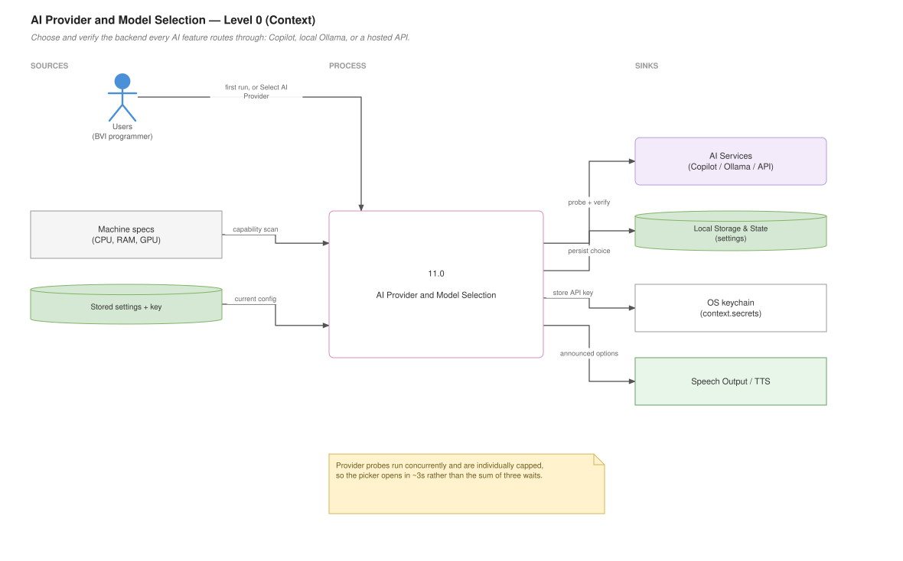
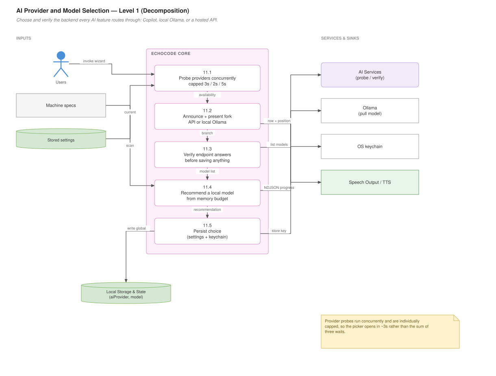

# AI Providers and Models

## For users

Several EchoCode features need a language model: the [Chat Tutor](Chat-Tutor), [Annotations and Big-O](Annotations-and-Big-O), [Code Summaries](Code-Summaries), line explanations, and the [Assignment Tracker](Assignment-Tracker). Everything else — navigation, line read-out, file tools — works with no model at all.

You choose the backend once. Run **EchoCode: Select AI Provider & Model** from the Command Palette at any time to change it.

### The three options

**GitHub Copilot** — no API key, no billing setup. If you already have Copilot, EchoCode borrows it through VS Code's own language-model API. Copilot has a free tier, and students get Copilot Pro free through the GitHub Student Developer Pack. The first time EchoCode sends a request, VS Code asks you to authorise EchoCode to use the model — one dialog, once. Requests count against your Copilot allowance.

**Local model via Ollama** — runs entirely on your machine. Nothing leaves it, no account, no quota, no per-request cost. You need [Ollama](https://ollama.com) installed and running, plus disk space and RAM for a model. This is the genuinely unmetered option, and the right one if privacy matters or you are offline.

**A hosted API** — OpenAI, OpenRouter, Groq, Anthropic, or any OpenAI-compatible endpoint. You supply an API key and pay the provider directly. Most flexible, and the only one that requires setting up billing.

### Choosing a local model

If you pick Ollama and have no models installed, EchoCode offers to recommend one. It inspects your machine — CPU cores, RAM, and GPU — and picks the largest model that will actually fit, then reads the recommendation aloud before showing the list.

Recommendations run smallest to largest:

| Model | Needs about | Character |
|---|---|---|
| `qwen2.5-coder:1.5b` | 2.5 GB | Runs on almost anything. Basic explanations. |
| `llama3.2:3b` | 4 GB | Small, general, very fast. |
| `qwen2.5-coder:7b` | 7 GB | Strong code understanding. Good default. |
| `qwen2.5-coder:14b` | 12 GB | Noticeably better reasoning. Needs a healthy machine. |
| `qwen2.5-coder:32b` | 24 GB | Best local quality. Workstation class. |

Coder-tuned models are preferred at each size because EchoCode is a coding assistant.

Sizing matters more than it looks. A model that overruns your memory does not fail loudly — it swaps to disk, and EchoCode just feels broken. If your machine is below the smallest entry you still get an offer, with a warning that it will be slow.

You can override the recommendation, or type any Ollama model name. Downloads show a real progress bar and can be cancelled.

### Setting up a hosted API

EchoCode asks for the endpoint, then the key, then **verifies the endpoint answers before saving anything**. That means a typo'd URL or rejected key is caught immediately rather than surfacing later as a mysteriously broken feature. Once verified, you pick from the models that endpoint actually offers.

**Your key is stored in your operating system's keychain**, never in `settings.json`. Settings files are plaintext, often committed to git, and sync between machines — so there is deliberately no setting for the key. Leave the key box blank when reconfiguring and EchoCode reuses the stored one.

### What happens on later launches

EchoCode quietly re-checks that your chosen model still exists, because model lineups change often — an Ollama model gets removed, a Copilot model is renamed, an API key is revoked. If your configured model has vanished it offers to pick a new one. If everything matches, it says nothing.

The check is time-bounded so it cannot delay startup. Run **EchoCode: Check for AI Provider/Model Updates** to force it.

### If something is wrong

Open **View → Output → EchoCode**. Provider detection logs every probe and its result — whether Ollama answered, whether Copilot reported models, whether your API endpoint responded.

Common causes:

- **"Ollama is not responding"** — Ollama is not running, or is on a different port. The prompt offers Retry, Change Address, or switching to an API.
- **No Copilot models detected** — Copilot Chat is not installed, or you are not signed in.
- **API request failed** — the error text comes straight from the provider and usually names the real problem (bad key, wrong model, no credit).

### Data flow — Level 0 (context)

What goes in, what comes out, and who it talks to.



*Editable source: `wiki/diagrams/11-ai-provider-selection.drawio` — generated locally, see `wiki/diagrams/README.md`*

---

## For developers

### Data flow — Level 1 (decomposition)

The same feature opened up into its numbered sub-processes.



*Editable source: `wiki/diagrams/11-ai-provider-selection.drawio` — generated locally, see `wiki/diagrams/README.md`*


### The files

| File | Responsibility |
|---|---|
| `AIrequest.js` | Resolves settings, dispatches requests, the public AI surface |
| `aiProviderSetup.js` | The setup wizard, provider detection, startup re-check |
| `apiProviders.js` | Hosted-API presets and the two wire formats |
| `httpClient.js` | Dependency-free HTTP/NDJSON transport |
| `secretStore.js` | API keys via `context.secrets` |
| `systemScan.js` | Hardware probe and model recommendation |

All under `Core/program_settings/program_settings/`.

### The request path

Features do not talk to backends. They call one of the functions in `AIrequest.js`:

```
analyzeAI(code, instructionPrompt)          — annotations, Big-O, task scanning
requestTextFromMessages(messages, opts)     — chat, summaries
generateCodeFromVoice(transcript, context)  — voice-to-code
classifyVoiceIntent(transcript, commands)   — voice command matching
```

Each funnels into `dispatchMessages()`, which reads the resolved provider and routes to exactly one of three paths:

- **`copilot`** → `sendCopilotMessages()` → `vscode.lm` via `selectModel()`
- **`ollama`** → `sendOllamaPrompt()` → `POST /api/generate` through `httpClient`
- **`api`** → `sendApiChat()` in `apiProviders.js`

**Add a backend in `dispatchMessages`, not in a feature.** Every feature inherits it for free.

### Two wire formats

`apiProviders.js` abstracts the one real difference between hosted APIs:

```js
buildOpenAiBody(messages, model, opts)     // messages array, optional max_tokens
buildAnthropicBody(messages, model, opts)  // system as a top-level field, max_tokens required
```

Anthropic takes the system prompt as its own field rather than a message role and requires an explicit `max_tokens`, so its body is built separately. Each preset declares `wire: "openai" | "anthropic"`. A new OpenAI-compatible provider is a preset entry and nothing more.

### Model selection is two different problems

```js
listCopilotModels(opts)   // for menus — capped at 3s, throws on timeout
selectModel()             // for requests  — deliberately uncapped
```

`vscode.lm.selectChatModels()` does not read a cached list. It waits for Copilot Chat to activate, sign in, and fetch its catalog — unbounded, and routinely tens of seconds on a cold window. It is cold for exactly the users who never touch Copilot, because warming is skipped unless Copilot is the selected backend.

So the menu path is capped and treats "too slow" as "not installed", while the request path is uncapped because there the model *is* the work. **If you unify these, the wizard hangs again.**

`selectModel()` prefers, in order: the user's persisted `copilotModel`, then a `gpt-4` family match, then the first available. That `gpt-4` preference is why a Copilot user may get GPT-4 rather than Claude even though Copilot offers both.

### Provider detection runs concurrently

`detectProviders()` probes all three backends under `Promise.all`, so the caller waits for the slowest rather than the sum:

| Probe | Cap |
|---|---|
| Copilot (`listCopilotModels`) | 3s |
| Ollama (`/api/tags`) | 2s |
| Hosted API (`/models`) | 5s |

Each probe swallows its own failure and yields an empty list, so a missing extension or a stopped server degrades to "not available" rather than breaking setup.

Worst case for the whole phase is ~3s. It was previously the sum of three sequential probes with an unbounded Copilot call at the front, which is what made the picker take up to a minute with nothing rendered.

### The setup wizard is a small state machine

`pickProviderAndModel()` runs a loop over a top-level API-or-Local fork. Each branch can return the sentinel `BACK` to hand control back, which is what makes "Ollama isn't installed" recoverable without restarting setup. `MAX_BRANCH_HOPS` (12) stops a user bouncing between branches forever.

### Spoken quick picks

`showQuickPick` cannot report which row is highlighted — it resolves only once something is chosen. So the wizard uses `createQuickPick`, whose `onDidChangeActive` fires per keystroke, wrapped in `showAnnouncedQuickPick()`:

```js
class AnnouncedList {
  moveTo(item)   // returns the sentence to speak, or null if nothing changed
  describe()     // "qwen2.5-coder:7b. Recommended for this machine. 2 of 5."
}
```

Three details that are easy to get wrong:

- **Codicons are stripped before speaking.** `$(star-full) qwen2.5-coder:7b` would otherwise be read as "dollar sign paren star full".
- **Listeners subscribe before `items` is assigned**, because assigning items makes the first row active and that is the announcement the user needs on open.
- **Hosts without `createQuickPick` fall back** to `showQuickPick` with only the intro spoken. The test harness takes this path.

Position is counted against the full list. VS Code exposes no public view of the type-to-filter result, so while filtering the count includes rows the user cannot see.

### Speech does not block the UI

`speak()` in `aiProviderSetup.js` is fire-and-forget. `speakMessage` resolves only when the sentence has finished being read aloud — measured at ~5s for a short line — and every call site here speaks just before opening a quick pick. Awaiting it held the UI closed for the full utterance at every step. See [Speech Handler](Speech-Handler) for why interruption is safe.

### Hardware scan

`systemScan.js` never throws. Every probe resolves to `""` on failure — a missing tool must not block setup.

```js
memoryBudgetGb(specs)   // vram >= 4 ? max(vram, ram*0.55*0.75) : ram*0.55
```

GPU detection is deliberately asymmetric. NVIDIA is the only vendor exposing a reliable number from a driver-bundled CLI (`nvidia-smi`), so it is the only one trusted for sizing. On Apple Silicon, CPU and GPU share one pool, so total RAM is the budget and VRAM is not double-counted. On Windows, `Win32_VideoController.AdapterRAM` is capped at 4GB and wrong on modern cards, so the name is taken for display only and RAM drives the recommendation.

Each probe has a 4s timeout. On Windows the PowerShell `Get-CimInstance` call routinely uses most of it — PowerShell cold start alone is 1–2s.

### HTTP transport

`httpClient.js` is dependency-free on purpose: the extension ships as a VSIX and Node's built-ins are all it needs.

```js
requestJson(url, body, opts)    // buffered
requestNdjson(url, body, opts)  // line-delimited, for Ollama's /api/pull progress
```

One non-obvious rule in `requestNdjson`: a throw from `onEvent` aborts the request. Ollama returns **HTTP 200 with an `{"error": …}` line** for an unknown model, so swallowing that would report success on a failed download.

`describeError()` extracts the provider's own message from its JSON envelope — the difference between "invalid api key" and a wall of HTML.
