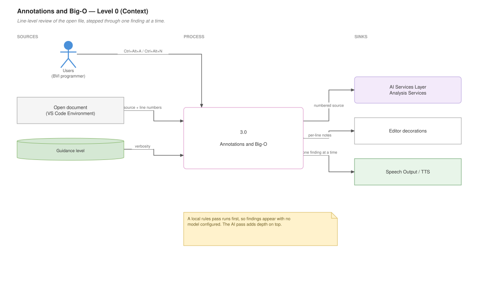
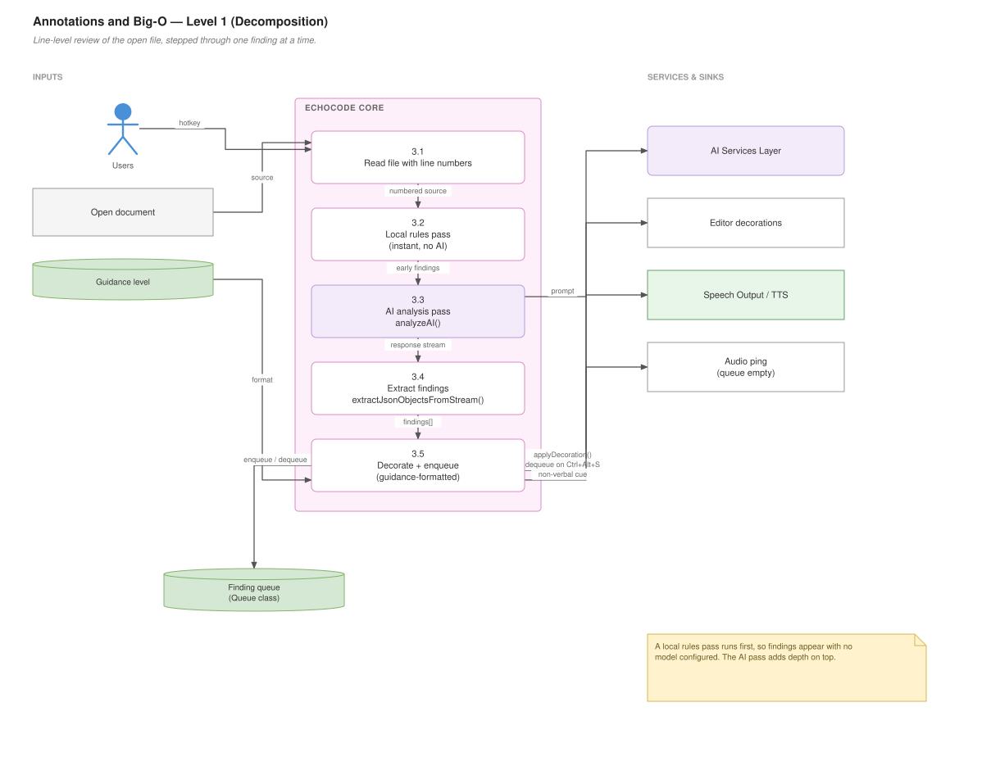

# Annotations and Big-O

## For users

Two related review features. **Annotations** flag general problems in your code; **Big-O analysis** flags performance problems specifically. Both attach notes to individual lines and read them aloud one at a time.

**Dev mode only.** Both are locked in Student mode.

### Annotations

**Ctrl+Alt+A** toggles annotations for the current file. EchoCode reviews it and attaches a note to each line worth commenting on.

| Shortcut | Does |
|---|---|
| **Ctrl+Alt+A** | Toggle annotations |
| **Ctrl+Alt+S** | Speak the next annotation |
| **Ctrl+Alt+Q** | Read all annotations |

The design point is stepping. Rather than dumping every issue at once, **Ctrl+Alt+S** walks you through them one line at a time so you can act on each before hearing the next.

### Big-O analysis

**Ctrl+Alt+N** analyses the current file's algorithmic complexity — nested loops, repeated scans, and similar patterns that make code slow as input grows.

| Shortcut | Does |
|---|---|
| **Ctrl+Alt+N** | Analyse Big-O |
| **Ctrl+Alt+B** | Read next recommendation |
| **Ctrl+Alt+H** | Read all recommendations |

Findings go into a queue. **Ctrl+Alt+B** advances through it. An audio cue plays when the queue is empty, so you know you have reached the end without being told in words.

### Fast findings arrive without a model

Both features check a set of built-in rules first, and those produce results immediately with no AI call. The AI pass adds deeper analysis on top. So you get useful output even with no model configured or while offline — just less of it.

### How verbose the notes are

Annotation wording follows your [guidance level](Modes-and-Guidance):

- **guided** — a coaching tone with next steps
- **balanced** — the finding, why it matters, one step
- **concise** — location and one sentence

Change it with **Ctrl+Alt+Z**.

### What you see on screen

Findings are also attached to lines as editor decorations, so a sighted collaborator can see the same notes you are hearing. Toggling annotations off clears them.

### Data flow — Level 0 (context)

What goes in, what comes out, and who it talks to.



*Editable source: [`03-annotations-bigo.drawio`](diagrams/03-annotations-bigo.drawio)*

---

## For developers

### Data flow — Level 1 (decomposition)

The same feature opened up into its numbered sub-processes.



*Editable source: [`03-annotations-bigo.drawio`](diagrams/03-annotations-bigo.drawio)*


### Files

| File | Responsibility |
|---|---|
| `program_features/Annotations_BigO/annotations.js` | General annotations (~424 lines) |
| `program_features/Annotations_BigO/bigOAnalysis.js` | Complexity analysis (~439 lines) |
| `program_features/Annotations_BigO/queue_system.js` | The `Queue` class with an audio cue |

### The shared shape

Both follow the same pipeline:

```
1. Local rules pass   — checkLocalRules / checkLocalBigORules  (instant, no AI)
2. AI pass            — analyzeAI() with a feature-specific prompt
3. Parse response     — extract structured findings from a text stream
4. Apply decorations  — applyDecoration(editor, line, text)
5. Enqueue            — for stepped read-out
```

Step 1 existing separately is deliberate: it makes the feature useful with no model configured, and gives instant feedback before the network round trip returns.

### Parsing a stream of JSON objects

`annotations.js` has `extractJsonObjectsFromStream(streamText)` rather than a plain `JSON.parse`. Models emit findings as a sequence of objects, sometimes wrapped in prose or fenced code, sometimes truncated. This scans for balanced object boundaries and yields whatever parses, so a malformed tail does not discard the good findings before it.

`bigOAnalysis.js` has `cleanResponse(rawResponse)` for the same class of problem — stripping fences and commentary before parsing.

**This is the fragile seam.** If annotations stop appearing after a model or prompt change, look here first: the request probably succeeded and the parse dropped everything.

### The queue and its audio cue

```js
class Queue {
  enqueue(el) / dequeue() / peek() / isEmpty() / size() / clear()
  async playSound()
}
```

`playSound()` (via `sound-play`, from `audio_pings/`) signals an empty queue non-verbally. A spoken "no more annotations" every time is far more tiring than a short tone — worth keeping in mind before replacing it with speech.

`iterateBigOQueue()` dequeues and speaks one item; `readEntireBigOQueue()` drains the whole queue sequentially. Because speech interrupts rather than queues, draining relies on awaiting each utterance — see [Speech Handler](Speech-Handler).

### Decorations

`applyDecoration(editor, line, suggestionText)` builds a `TextEditorDecorationType` and applies it at a line range. `clearDecorations()` disposes them on toggle-off.

Decoration types are VS Code resources and must be disposed, not just cleared — leaking them accumulates render overhead across toggles.

### Loop detection

`bigOAnalysis.js` does structural analysis before involving a model:

```js
detectLoops(document)                      // find loop constructs
analyzeLoops(editor, loops, collectedIssues) // nesting depth → complexity
addBigOIssue(editor, line, suggestion, collectedIssues)
finalizeQueue(issues)
```

This is text/structure based, not a real parser, so it is a heuristic — good at nested `for` loops, weaker on complexity hidden behind function calls.

### Prompt construction

`annotations.js` builds its prompt from the guidance level plus the file body:

```js
buildAnnotationPrompt()                  // guidance-aware instruction text
getEntireFileWithLineNumbers(textEditor) // numbered source, so the model can cite lines
loadAnnotationSettings()                 // reads per-feature settings from disk if present
```

Sending line numbers is what lets findings map back to decorations. `bigOAnalysis.js` uses a fixed `ANNOTATION_PROMPT` constant instead.

### Registration

```js
registerAnnotationCommands(context, outputChannel)  // annotations.js
registerBigOCommand(context)                        // bigOAnalysis.js
```

`extension.js` calls both under the `annotationsBigO` feature key and combines their disposables with `vscode.Disposable.from(...)`.

Note the command ids for Big-O use the `code-tutor.` prefix, not `echocode.` — `code-tutor.analyzeBigO`, `code-tutor.iterateBigOQueue`, `code-tutor.readEntireBigOQueue`. A leftover from an earlier name. `guard.js` locks both prefixes in Student mode, including some stale `code-tutor.*` ids that no longer exist.

### Swappable

Both live under the `annotationsBigO` feature key, so the whole subsystem can be replaced via `echocode.featureImplementation.annotationsBigO`. See [Custom Feature Implementations](Custom-Feature-Implementations).
