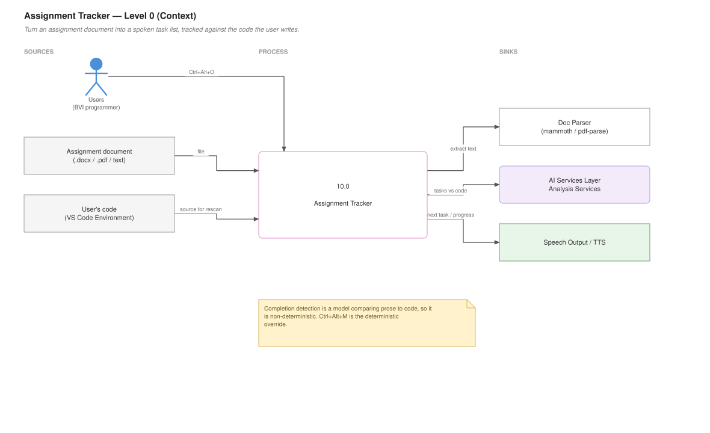
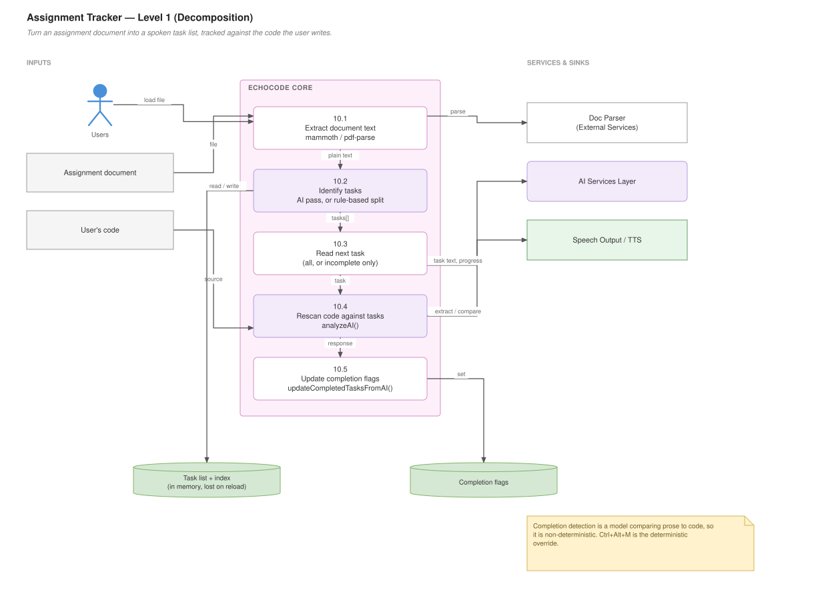

# Assignment Tracker

## For users

Load an assignment document, and EchoCode turns it into a spoken task list it can track against the code you write.

**Dev mode only.** Locked in Student mode — which is worth noting, since students are the obvious audience. See [Modes and Guidance](Modes-and-Guidance).

### Loading an assignment

**Ctrl+Alt+O** opens a file picker. EchoCode reads the document, extracts the individual tasks, and tells you how many it found.

Word documents and PDFs work as well as plain text — the extension bundles readers for both.

### Working through tasks

| Shortcut | Does |
|---|---|
| **Ctrl+Alt+T** | Read the next task |
| **Ctrl+Alt+/** | Read the next *incomplete* task |
| **Ctrl+Alt+M** | Mark the current task complete |
| **Ctrl+Alt+Y** | Rescan your code for completed tasks |

**Ctrl+Alt+T** steps through every task in order. **Ctrl+Alt+/** skips ones already done, which is what you want when returning to work after a break.

### Automatic progress detection

**Ctrl+Alt+Y** is the interesting one. EchoCode reads your current code, compares it against the task list, and marks off the tasks it believes you have completed. You hear a summary of what it found.

Treat it as a helpful guess, not a grade. It is a language model comparing prose requirements against code, so it can miss a task you finished unusually or credit one you only partly did. **Ctrl+Alt+M** is the manual override.

### Requirements and limits

Needs an AI backend for task extraction and rescanning — see [AI Providers and Models](AI-Providers-and-Models).

The task list lives in memory for the session. Reloading the window clears it, and you load the assignment again. Progress is not saved to disk.

### Data flow — Level 0 (context)

What goes in, what comes out, and who it talks to.



*Editable source: `wiki/diagrams/10-assignment-tracker.drawio` — generated locally, see `wiki/diagrams/README.md`*

---

## For developers

### Data flow — Level 1 (decomposition)

The same feature opened up into its numbered sub-processes.



*Editable source: `wiki/diagrams/10-assignment-tracker.drawio` — generated locally, see `wiki/diagrams/README.md`*


### File

`program_features/Assignment_Tracker/assignmentTracker.js` — ~289 lines, under the `assignmentTracker` feature key.

### State

Module-level, and deliberately simple:

```js
taskList          // extracted task strings
currentTaskIndex  // cursor for readNextTask
// completion tracked per task
function resetTasks()   // called on every load
```

Nothing persists. A reload clears everything, which is the main limitation and the obvious improvement: `context.globalState` or `workspaceState` keyed by assignment path would survive reloads.

### Loading and extraction

```js
async function loadAssignmentFile()
async function parseTasksWithAI(text)
function parseTasksFromText(text)
```

`loadAssignmentFile` shows a file picker, extracts text, and hands it to extraction. Document readers come from bundled dependencies — `mammoth` for `.docx`, `pdf-parse` for PDFs — which is why they must not be excluded from the VSIX.

**Two extraction paths.** `parseTasksWithAI` asks the model to identify discrete tasks; `parseTasksFromText` does rule-based splitting. The rule-based path means loading an assignment does something useful with no model configured, and covers the case where the AI call fails.

`resetTasks()` is called first, so loading a second assignment replaces rather than appends.

### Reading tasks

```js
function readNextTask()              // sequential, includes completed
function readNextSequentialTask()    // skips completed
function markTaskComplete()
```

The two read functions are separately bound (**Ctrl+Alt+T** and **Ctrl+Alt+/**) because both behaviours are genuinely wanted — review everything, or continue where you left off. Their names are easy to confuse: `readNextTask` is the *unfiltered* one despite "sequential" appearing in the other's name.

### Rescanning

```js
async function rescanUserCode()
function updateCompletedTasksFromAI(responseText)
```

`rescanUserCode` sends the current code and the task list to `analyzeAI()`, then `updateCompletedTasksFromAI` parses the reply and flips completion flags.

That parse is the fragile part, as with [annotations](Annotations-and-Big-O): the model returns prose or loosely-structured text and the parser has to find task identifiers in it. If rescanning stops detecting anything after a model change, the request probably succeeded and the parse found nothing. Log the raw response before assuming the AI call failed.

Because the AI decides completion, results are **non-deterministic** — the same code and tasks can produce different answers across runs. `markTaskComplete()` exists as the deterministic override and should stay.

### Registration

```js
registerAssignmentTrackerCommands(context)
```

Registers all five commands, each wrapped in `guard()`. All five are in `STUDENT_LOCKED_COMMANDS`.

### Worthwhile improvements

- **Persist progress** in `workspaceState` keyed by assignment path. The single highest-value change.
- **Make rescan incremental** — it currently re-evaluates every task on every scan, which costs a full AI round trip over the whole task list.
- **Report confidence** so the user can distinguish a confident match from a guess.
