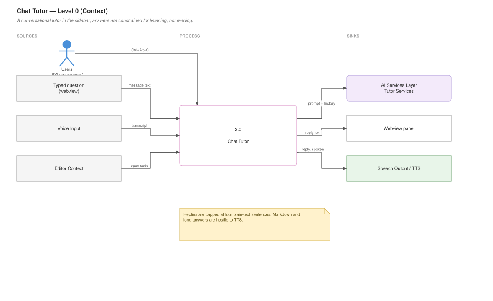
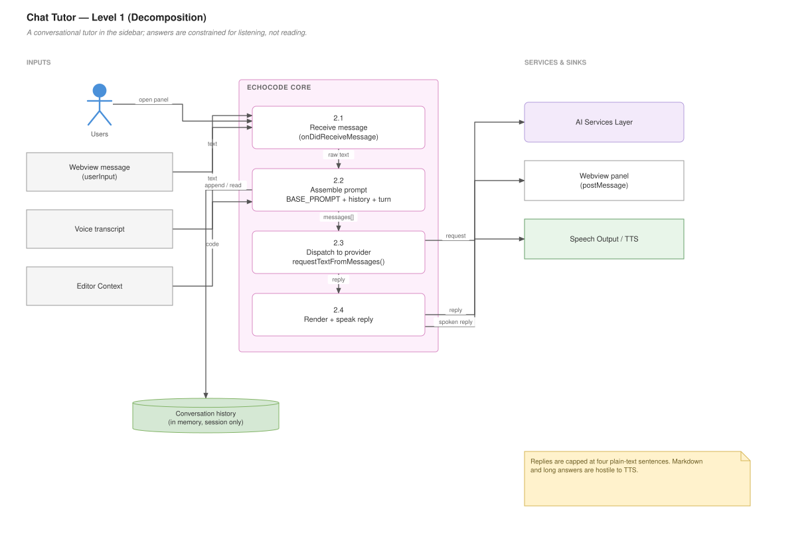

# Chat Tutor

## For users

A conversational coding tutor that lives in the VS Code sidebar. Ask it a question about your code and it answers in speech and text.

**Dev mode only.** Locked in Student mode.

### Opening it

- **Ctrl+Alt+C** with focus in the editor, or
- Click the EchoCode icon in the Activity Bar, or
- Command Palette → **Open EchoCode Tutor Chat**

### Using it

Type a question and press Enter. The reply appears in the panel and is read aloud.

You can also talk to it. Either use the panel's own voice button, or set the voice mode to **Chat Tutor** (**Ctrl+Alt+'**) and press **Ctrl+Alt+Space** — your speech becomes the message. See [Voice Input](Voice-Input).

### What it is tuned for

The tutor is deliberately brief. It is instructed to keep answers under four sentences, use plain text with no markdown, explain simply, give small examples, and offer a follow-up tip when useful.

That is a speech-first choice. Long markdown-heavy answers are miserable to listen to — code fences, bullet characters, and headings all get read out literally or mangled. Four plain sentences works aloud.

If code is open, the tutor focuses on it. Otherwise it answers generally.

### It remembers the conversation

Follow-up questions work — the tutor keeps the exchange in memory, so "why?" after an answer refers to that answer. History lasts as long as the panel does; closing the sidebar or reloading the window clears it.

### Requirements

Needs an AI backend. If you have not set one up, see [AI Providers and Models](AI-Providers-and-Models). Errors are reported in the panel and in **View → Output → EchoCode**.

### Data flow — Level 0 (context)

What goes in, what comes out, and who it talks to.



*Editable source: [`02-chat-tutor.drawio`](diagrams/02-chat-tutor.drawio)*

---

## For developers

### Data flow — Level 1 (decomposition)

The same feature opened up into its numbered sub-processes.



*Editable source: [`02-chat-tutor.drawio`](diagrams/02-chat-tutor.drawio)*


### Files

| File | Responsibility |
|---|---|
| `program_features/ChatBot/Chat_Tutor.js` | The webview provider and message handling |
| `media/chat.js` | Webview-side script (~191 lines) |
| `media/` | Stylesheet and assets |

Declared in `package.json` as a webview view inside EchoCode's own Activity Bar container:

```json
"viewsContainers": { "activitybar": [{ "id": "echocode", "title": "EchoCode", "icon": "images/icon.png" }] },
"views": { "echocode": [{ "id": "echocode.chatView", "name": "EchoCode Tutor", "type": "webview" }] }
```

### The provider

`EchoCodeChatViewProvider` implements `resolveWebviewView`. State it holds:

```js
this._view              // the WebviewView
this._currentWebview    // nulled on dispose, so posts after teardown are skipped
this._isListening       // recording state, for the panel's voice button
this.conversationHistory // [{ user, response }]
```

`enableScripts: true` with `localResourceRoots: [this.context.extensionUri]` — scripts run, but only assets from the extension directory load.

### Message protocol

Extension ← webview, via `onDidReceiveMessage`:

| `message.type` | Meaning |
|---|---|
| `userInput` | Typed text; `message.text` carries it |
| `executeVoiceCommand` | The panel's voice button was pressed |

Extension → webview, via `postMessage`: response payloads plus recording-state signals such as `voiceStopping`, which lets the panel show that transcription is in progress.

### A circular require to be aware of

The voice path in the provider does:

```js
const { tryExecuteVoiceCommand } = require("../../extension");
```

That is a **circular dependency** — `extension.js` loads `Chat_Tutor.js`, which requires `extension.js` back. It works because the require happens lazily inside the handler rather than at module load, by which point `extension.js` has finished evaluating and populated its exports. Hoisting it to the top of the file would get a partially-initialised module and `tryExecuteVoiceCommand` would be `undefined`.

If you refactor this, the clean fix is passing the router in through the constructor rather than reaching back for it.

### The system prompt

`BASE_PROMPT` is a module constant. The four-sentence, no-markdown constraint is load-bearing for speech output, not a stylistic preference — see the user section above. Prepended to the conversation on every request.

### Request path

`handleUserMessage(text)` assembles `BASE_PROMPT` plus history plus the new turn and calls `requestTextFromMessages()` from `AIrequest.js`. The provider does not know which backend answers — see [AI Providers and Models](AI-Providers-and-Models).

Replies are posted to the webview and spoken through `speakMessage`. Because speech interrupts rather than queues, a new reply cuts off the previous one; see [Speech Handler](Speech-Handler).

### Webview security

`getNonce()` generates a per-load nonce for the Content Security Policy, so only EchoCode's own inline script executes. Keep that if you edit the HTML — dropping the nonce opens the panel to arbitrary script injection from anything that reaches the rendered content.

### Registration

`registerChatCommands(context, outputChannel)` registers `echocode.openChat` and returns the provider instance, which `extension.js` keeps as `chatProvider` so voice handlers can push transcripts straight into it via `chatProvider.handleUserMessage(text)` without going through the command layer.
