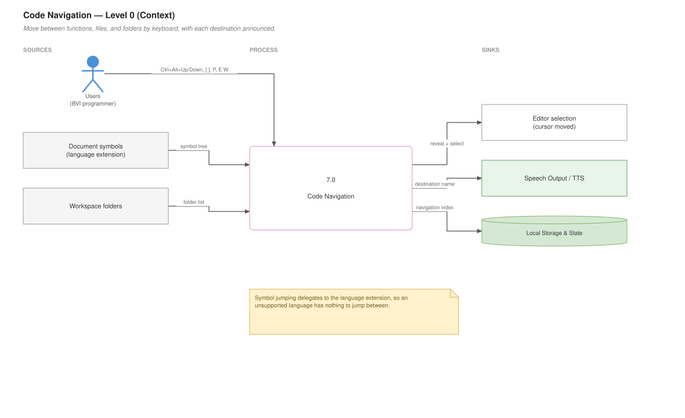
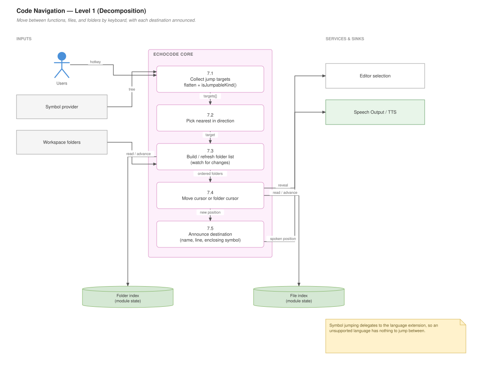

# Code Navigation

## For users

Moving around code without scrolling. All of these work in Student mode.

### Jump between functions

| Shortcut | Does |
|---|---|
| **Ctrl+Alt+Down** | Jump to next function |
| **Ctrl+Alt+Up** | Jump to previous function |

The cursor moves to the next or previous definition and its name is announced. This is the fastest way to traverse an unfamiliar file — jump, listen to the name, jump again.

Pairs naturally with **Ctrl+Alt+E F** to summarise each one as you land on it. See [Code Summaries](Code-Summaries).

Jumping covers functions, methods, classes, and similar top-level constructs — not every variable.

### Where am I? — Ctrl+Alt+E W

Describes your cursor's position in context: the line number, and the construct you are inside.

This is the orientation command. After a jump, a search, or coming back from another window, it tells you where you actually are. A two-step chord: **Ctrl+Alt+E**, then **W**.

### Move between files

| Shortcut | Does |
|---|---|
| **Ctrl+Alt+P** | Navigate to next file |
| **Ctrl+Alt+[** | Move to next folder |
| **Ctrl+Alt+]** | Move to previous folder |

Folder navigation walks your workspace's folder list, announcing each folder as you arrive. File navigation steps through files within the current folder.

The folder list is built when the workspace opens and kept current as you add or remove folders, so newly created directories appear without a reload.

### Caveats worth knowing

Function jumping depends on VS Code understanding the language, which means the relevant language extension must be installed. In Python with Pylance it works well. In a language with no extension installed, there is nothing to jump between and EchoCode says so.

There is a **Navigate Files in Current Folder** entry in the Command Palette that does not work — see [Known Gaps](Known-Gaps). Use **Ctrl+Alt+P**.

### Data flow — Level 0 (context)

What goes in, what comes out, and who it talks to.



*Editable source: `wiki/diagrams/07-code-navigation.drawio` — generated locally, see `wiki/diagrams/README.md`*

---

## For developers

### Data flow — Level 1 (decomposition)

The same feature opened up into its numbered sub-processes.



*Editable source: `wiki/diagrams/07-code-navigation.drawio` — generated locally, see `wiki/diagrams/README.md`*


### Files

| File | Responsibility |
|---|---|
| `navigation_features/navigationHandler.js` | Function/symbol jumping (~152 lines) |
| `navigation_features/whereAmI.js` | Cursor position description (~69 lines) |
| `navigation_features/Folder_File_Navigator/folder_navigator.js` | Folder traversal (~219 lines) |
| `navigation_features/Folder_File_Navigator/file_navigator.js` | File traversal (~86 lines) |
| `navigation_features/Folder_File_Navigator/workspace_folder_watcher.js` | Keeps the folder list fresh (~33 lines) |

These are **not** under `program_features/`, so none of them go through the feature-implementation loader. They cannot be swapped via settings, and `extension.js` calls their registrars directly:

```js
registerWhereAmICommand(context);
registerMoveCursor(context);
registerFileNavigatorCommand(context);
registerFolderNavigatorCommands(context);
```

### Symbol jumping

Like the summarizer, this delegates language understanding to VS Code rather than parsing:

```js
async function getJumpTargets(document)    // executeDocumentSymbolProvider
function flattenSymbols(symbols, parent)   // DocumentSymbol tree → flat list
function isJumpableKind(kind)              // filter to interesting SymbolKinds
function prettyName(sym)                   // spoken label
function getPositionFromRange(document, range)
async function moveCursorToSymbol(direction)
```

The pipeline: ask the symbol provider, flatten the nested tree, filter by kind, sort by position, then find the nearest target in the requested direction.

`flattenSymbols` carries a `parent` array as it descends, which is what lets `prettyName` produce a qualified label like `ClassName.methodName` rather than a bare `methodName`.

`isJumpableKind` is the tuning knob. Including every `SymbolKind` would make jumping land on variables and constants, which is too fine-grained to be useful aurally. If jumping feels wrong for a language, this filter is the first place to look.

### Where am I

```js
async function describeCursorPosition(editor)
```

Combines line number with the enclosing symbol, using the same provider. It is the natural complement to `Ctrl+Alt+L`, which reads trimmed line text and therefore loses indentation and context.

### Folder navigation state

```js
async function initializeFolderList()      // build the ordered list
async function moveToNextFolder()
async function moveToPreviousFolder()
async function watchFolderForChanges()
function getCurrentFolder()                // exported for other features
```

The list and the current index are **module-level state**, so they reset on reload. `initializeFolderList` is called during activation; `echocode.initializeFolderList` exists as a command to rebuild it manually (its keybinding entry has an empty `key`, so it is Palette-only).

`getCurrentFolder()` is exported because other features need the navigation cursor — [File and Folder Tools](File-and-Folder-Tools) creates new files relative to it.

`workspace_folder_watcher.js` and `watchFolderForChanges` keep the list current. Both use `fs.existsSync`/`lstatSync` to confirm a path is still a directory before including it, so a deleted folder does not leave a dead entry.

### File navigation

```js
async function navigateToNextFile()
function watchWorkspaceForFileChanges()
```

Steps through files in the current folder, also with module-level index state.

### The unregistered command

`echocode.navigateFilesInCurrentFolder` is declared in `package.json` but **registered nowhere in the source**. It appears in the Command Palette and errors when invoked. `file_navigator.js` exports only `registerFileNavigatorCommand`, which registers `echocode.navigateToNextFile`.

Either implement it or remove the manifest entry. See [Known Gaps](Known-Gaps).

### Adding a navigation feature

If it is language-aware, use `executeDocumentSymbolProvider` rather than parsing — you inherit every language the user has support for, and stay correct as those extensions improve.

Keep in mind the symbol provider is **async and can be slow** on a cold language server or a large file. Do not call it on a high-frequency event such as cursor movement without debouncing.
