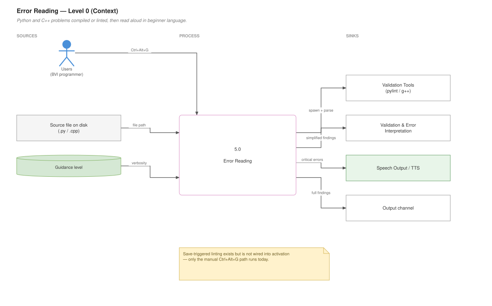
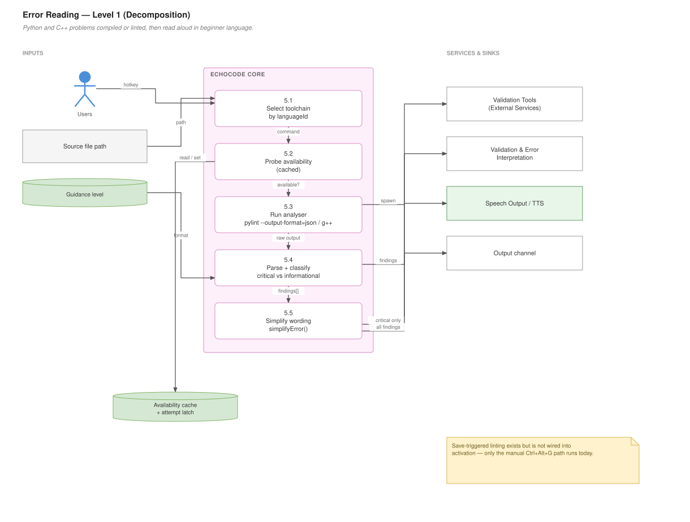

# Error Reading

## For users

EchoCode compiles or lints your code and reads the problems aloud in plain language rather than compiler jargon.

**Dev mode only.** Locked in Student mode — error parsers can effectively solve an assignment.

### One shortcut, two languages

**Ctrl+Alt+G** does the right thing for the file you are in:

| File type | What happens |
|---|---|
| `.py` | Runs pylint and reads the findings |
| `.cpp` | Compiles with `g++` and reads the compiler errors |

The binding is gated on the file's language, so the same chord is unambiguous.

### Python

Requires `pylint` in the Python environment EchoCode invokes:

```bash
python3 -m pip install pylint
```

On Windows use `python` instead of `python3`.

Use `-m pip` rather than a bare `pip` — it installs into the *same* interpreter EchoCode shells out to. A bare `pip` can belong to a different Python, which produces the confusing case where the install succeeds and EchoCode still reports pylint missing.

Findings are translated into beginner-friendly language. Instead of `undefined-variable`, you hear *"This variable is not defined. Did you forget to create it?"* A small set of common messages have hand-written explanations; everything else is read as pylint phrased it.

Some findings are marked **critical** — undefined variables, syntax errors, indentation errors — and those are the ones read aloud. The rest go to the output channel so the readout stays short.

### C++

Requires `g++` on your PATH. EchoCode compiles the current file, parses the compiler output, and reads the errors with their line numbers.

### How verbose it is

Error explanations follow your [guidance level](Modes-and-Guidance) — **Ctrl+Alt+Z** cycles it. `concise` gives you location plus one sentence; `guided` adds next steps.

### Known limitation: nothing happens on save

Automatic linting when you save a Python file is **not currently active**. The code for it exists but is not wired into startup, so only the manual **Ctrl+Alt+G** path works. See [Known Gaps](Known-Gaps).

The `Read Python Errors Aloud` entry in the Command Palette is part of that same dormant feature and will not work — use **Ctrl+Alt+G** instead.

### Data flow — Level 0 (context)

What goes in, what comes out, and who it talks to.



*Editable source: [`05-error-reading.drawio`](diagrams/05-error-reading.drawio)*

---

## For developers

### Data flow — Level 1 (decomposition)

The same feature opened up into its numbered sub-processes.



*Editable source: [`05-error-reading.drawio`](diagrams/05-error-reading.drawio)*


### Files

| File | Responsibility | Live? |
|---|---|---|
| `Language/Python/pylintHandler.js` | Spawns pylint, classifies failures, translates messages | Yes |
| `Language/Python/errorHandler.js` | Save-triggered linting and spoken readout | **No — never invoked** |
| `program_features/C++_Error_Parser/Python_Error_Parser.js` | `checkCurrentPythonFile`, the live manual path | Yes |
| `program_features/C++_Error_Parser/CPP_Error_Parser.js` | C++ compile and parse | Yes |
| `Language/registry.js` | Per-language adapter lookup | Yes |

### The dormant module

`extension.js` imports both of `errorHandler.js`'s entry points and **calls neither**:

```js
const { initializeErrorHandling, registerErrorHandlingCommands } = require("./Language/Python/errorHandler");
```

Those are the only two occurrences in the file. Consequences:

- `registerErrorHandlingCommands` registers the `onDidSaveTextDocument` listener, so **pylint has never run on save**.
- It also registers `echocode.readErrors`, which is declared in `package.json` but therefore never registered at runtime — invoking it from the Palette fails.
- `initializeErrorHandling(channel)` supplies the output channel, so the module's `outputChannel` is `undefined`.

`extension.js` also logs `"Commands registered: echocode.readErrors, …"` at startup. That log is wrong.

Turning it on is two calls in `activate()`:

```js
initializeErrorHandling(outputChannel);
registerErrorHandlingCommands(context);
```

Be deliberate about it — that switches on a toast or an auto-opening output panel on every Python save, plus spoken critical errors. It is a user-visible behaviour change, not just a fix.

### The live Python path

`echocode.checkPythonErrors` is registered directly in `extension.js`, guarded, and language-checked:

```js
if (editor && editor.document.languageId === "python") {
  featureImplementations.checkCurrentPythonFile(editor.document.uri.fsPath);
}
```

`checkCurrentPythonFile` comes from `program_features/C++_Error_Parser/Python_Error_Parser.js` — a confusing home for it, but that is where it lives, and it has a `UserImplementation/` variant.

### pylintHandler

```js
runPylint(filePath, outputChannel)   // → Promise<Array<{line, message, type, critical}>>
isPylintAvailable()                  // cached probe
promptToInstallPylint()
ensurePylintInstalled()
```

Failures are **classified**, not generic, so callers can tell a setup problem from a real failure:

```js
PYLINT_NOT_INSTALLED   // "No module named pylint" on stderr
PYTHON_NOT_FOUND       // spawn ENOENT
PYLINT_TIMED_OUT       // 10s cap
PYLINT_FAILED          // anything else
```

That distinction matters: a missing toolchain should prompt once, while a genuine pylint failure is worth reporting every time. Before it existed, a user without pylint got an error toast on **every save**.

Interpreter choice is platform-dependent, and the same helper drives both the spawn and the message shown to the user so they always match:

```js
function pythonCommand() {
  return process.platform === "win32" ? "python" : "python3";
}
```

Windows installs the interpreter as `python`; elsewhere a bare `python` may be a Python 2 stub or absent.

`isPylintAvailable()` caches its probe — re-spawning an interpreter on every save is exactly the cost worth avoiding. Call `resetPylintAvailability()` after the user installs it.

Three robustness details worth not regressing:

- **The 10s timeout is cleared on every exit path.** Left running, it fired ten seconds after a *successful* run and killed an already-dead process.
- **`spawn` has an `error` handler.** With a missing interpreter, spawn emits `error` and never emits `close`, so without this the promise hung until that stray timeout fired.
- **Exit code 0 with empty stdout is not success.** pylint's JSON output is the source of truth.

### Message translation

```js
function isCriticalError(symbol)   // Set of 5 pylint symbols
function simplifyError(symbol, message)  // lookup table, falls through to raw message
```

Critical set: `undefined-variable`, `syntax-error`, `indentation-error`, `attribute-defined-outside-init`, `assignment-from-none`. Only these are spoken; the rest go to the channel.

Adding a translation is one entry in the `explanations` object in `simplifyError`. Unknown symbols pass through unchanged, so the table can stay small.

### errorHandler, if you enable it

The dormant module has real work in it already:

- **400ms debounce per file** — a save-all or auto-save otherwise spawns one interpreter per file per burst, and pylint's ~300ms startup dominates its runtime.
- **`document.version` check** — a save that changed nothing does not re-lint.
- **Missing-toolchain latch** — after one failure, automatic runs stop rather than re-spawning to rediscover the same thing. The explicit command clears the latch, so it doubles as the retry.
- **The lint lock is released before speaking.** Speech is several seconds per finding; holding the lock across it meant every save during the readout was silently dropped.
- **Stale readouts stop.** A generation counter means newer results cancel an in-progress readout rather than narrating findings that no longer apply.

Measured pylint cost, for sizing decisions: ~320ms on 48 lines, ~385ms on 498, ~635ms on 1998. Roughly 300ms of that is fixed interpreter and astroid startup, independent of file size — which is why debouncing helps far more than optimising the analysis.

### C++ parsing

```js
parseCppCompilationErrors(terminalOutput)
analyzeCppCompilation(command, outputFilePath)
compileCurrentCppFile(currentFilePath)
findCppSourceFiles(dir)
```

Compiles, then parses `g++`'s text output with pattern matching. Tied to GCC-style diagnostics — clang's format is close enough to mostly work, MSVC's is not.

### Language adapters

`Language/registry.js` is a small indirection for per-language behaviour:

```js
function pickAdapter(langId)   // → adapter or NoOpAdapter
function safeRequire(p)        // missing adapter ≠ crash
```

`NoOpAdapter` is the fallback, so an unsupported language degrades silently. This is the seam to use for a third language — add an adapter rather than another `if (languageId === …)` branch in `extension.js`.
