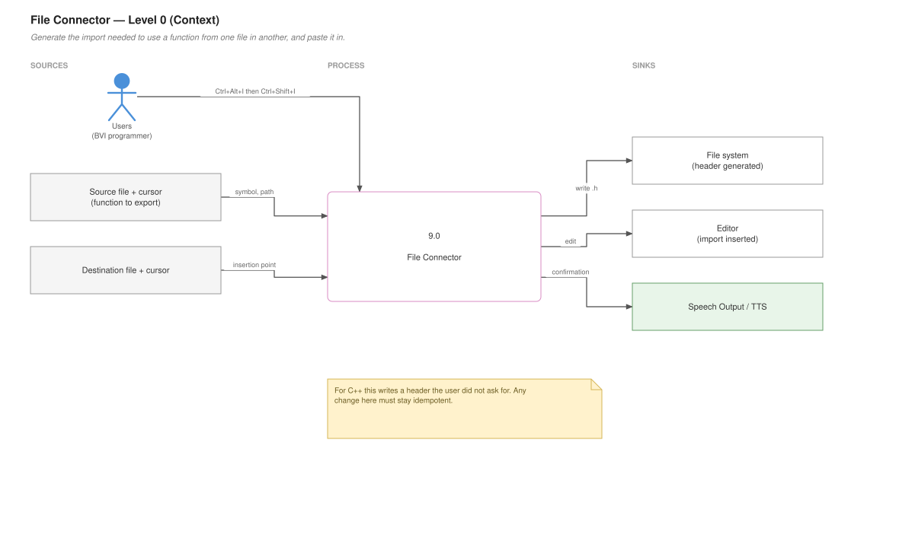
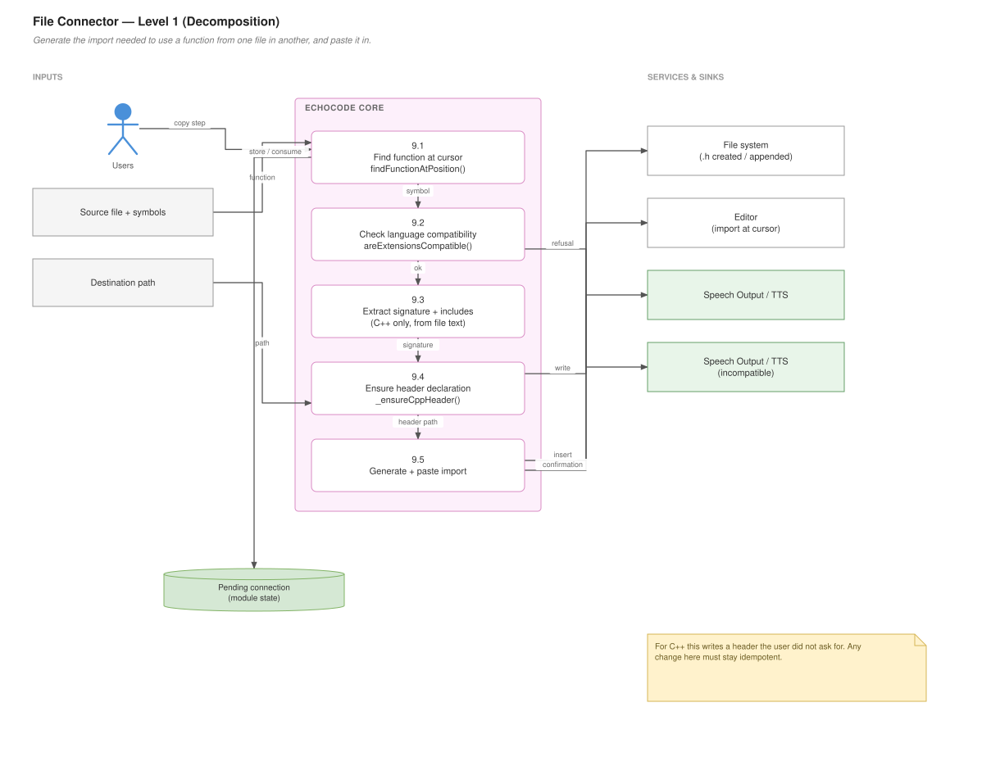

# File Connector

## For users

Generates the import statement needed to use a function from one file in another, and pastes it in for you.

**Dev mode only.** Locked in Student mode.

### The two-step flow

| Step | Shortcut | Does |
|---|---|---|
| 1 | **Ctrl+Alt+I** | In the *source* file, with the cursor in a function — copy it for import |
| 2 | **Ctrl+Shift+I** | In the *destination* file — paste the import statement |

You never type the import path yourself, and you never have to work out the relative path between two files by ear.

### Python

Copying `calculate_total` from `utils/math_helpers.py`, then pasting in `main.py`, gets you a correct `from … import …` line with the module path resolved for you.

### C++

More is done on your behalf. EchoCode extracts the function's signature, and if the source file has **no header**, it creates one and adds the declaration. Then it inserts the right `#include` in the destination.

That is the tedious part of C++ done automatically: declaration in a header, definition left in the `.cpp`, include wired up.

Existing `#include` lines in the source are read so the generated header carries the dependencies the declaration needs.

### If it does not work

- **"No function at cursor"** — put the cursor inside a function body or on its signature. EchoCode uses the language's own symbol information, so the relevant language extension must be installed.
- **Incompatible file types** — connecting a Python function into a C++ file is refused. Both files must be the same language.
- **Nothing copied** — step 1 must succeed before step 2 has anything to paste.

### Data flow — Level 0 (context)

What goes in, what comes out, and who it talks to.



*Editable source: [`09-file-connector.drawio`](diagrams/09-file-connector.drawio)*

---

## For developers

### Data flow — Level 1 (decomposition)

The same feature opened up into its numbered sub-processes.



*Editable source: [`09-file-connector.drawio`](diagrams/09-file-connector.drawio)*


### File

`program_features/FileConnector/File_Connector.js` — ~452 lines, the largest single feature module. Under the `fileConnector` feature key.

### Public surface

```js
connectFunction(...)            // the orchestrator
findFunctionAtPosition(symbols, position)
areExtensionsCompatible(source, dest)
registerFileConnectorCommands(context, vscode)
```

Note the registrar takes `vscode` as a parameter rather than requiring it — unusual in this codebase, and a small dependency-injection seam that makes the module testable without the module-level `vscode` mock.

### Private helpers, by language

Underscore-prefixed by convention:

**Python**
```js
_baseFunctionName(name)
_generatePythonImport(sourcePath, functionName)
```

**C++**
```js
_extractCppFunctionSignature(sourcePath, functionName)
_extractCppIncludes(sourcePath)
_ensureCppHeader(sourcePath, functionName, functionSignature)
_generateCppImport(...)
_generateCppHeaderInclude(sourcePath, destPath)
```

The asymmetry is inherent: Python imports are a module path, while C++ needs a declaration in a header plus an include. Roughly three-quarters of the module is the C++ path.

### Finding the function

```js
findFunctionAtPosition(symbols, position)
```

Operates on a `DocumentSymbol` tree from `executeDocumentSymbolProvider`, the same approach as [Code Summaries](Code-Summaries) and [Code Navigation](Code-Navigation) — language understanding is borrowed from whichever extension owns the file rather than parsed here.

`_extractCppFunctionSignature` is the exception: it goes to the file text with `readFileSync`, because the symbol tree gives a range and a name but not a usable declaration string.

### Header generation

`_ensureCppHeader` is the most consequential function — it **writes a file the user did not ask for**. Behaviour:

- No header exists → create it with an include guard and the declaration
- Header exists without this declaration → append it
- Declaration already present → leave it alone

Combined with `_extractCppIncludes`, so a generated header carries what the declaration needs to compile.

Anything here is user-visible file modification. Treat changes as higher-risk than the rest of the module and check the idempotency: running the command twice must not duplicate a declaration.

### Compatibility gate

```js
function areExtensionsCompatible(source, dest)
```

Refuses cross-language connections. Called before generation, so an unsupported pair fails with a clear message rather than producing a syntactically valid but meaningless import.

This is where a new language starts: add the pair, then a `_generate<Lang>Import`.

### State between the two commands

`echocode.copyFileNameForImport` stores the pending connection; `echocode.pasteImportAtCursor` consumes it. That handoff is module-level state and does not survive a reload — the copy must be repeated after one.

### Adding a language

1. Extend `areExtensionsCompatible` with the extension pair.
2. Add `_generate<Lang>Import(sourcePath, functionName)`.
3. Dispatch on extension in `connectFunction`.
4. If the language needs a declaration file, model it on `_ensureCppHeader` — and make it idempotent.

Prefer the symbol provider over text parsing wherever the information is available; fall back to reading the file only for things symbols cannot give you, as the C++ signature extraction does.
