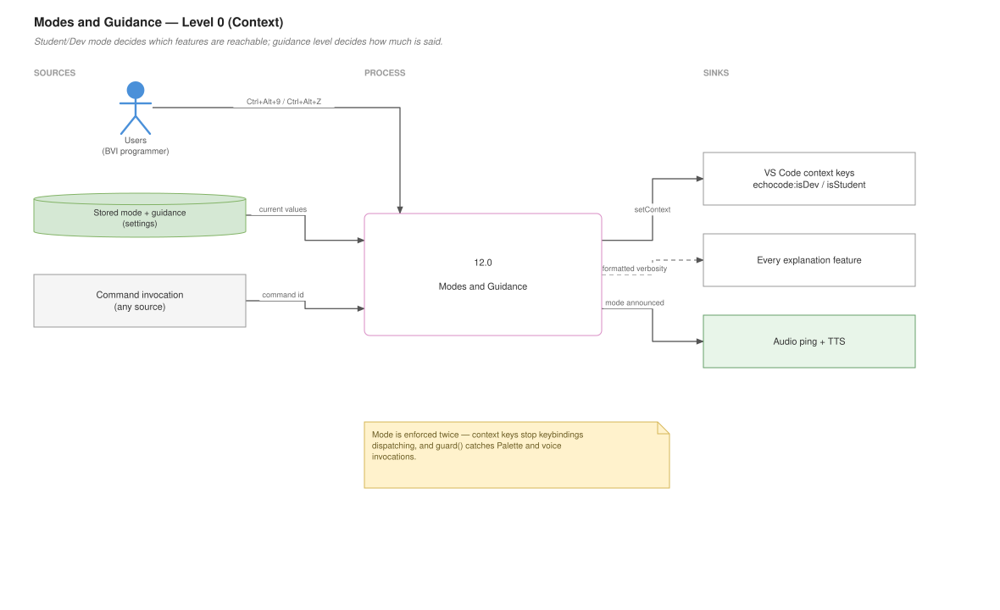
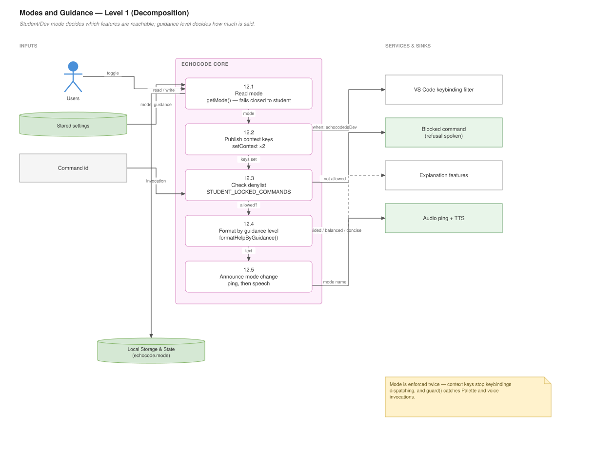

# Modes and Guidance

## For users

Two independent dials. **Mode** controls *which* features you can use. **Guidance level** controls *how much* EchoCode says.

## Student mode and Dev mode

EchoCode starts in **Student mode**.

| Shortcut | Does |
|---|---|
| **Ctrl+Alt+9** | Toggle between modes |

Also available as **EchoCode: Switch to Student Mode** / **Switch to Developer Mode** in the Command Palette.

The mode change is announced aloud, with a distinct audio ping for each — so you can tell which mode you are in without waiting for words.

### What Student mode locks

Student mode disables the features that would do a student's work for them:

- The [Chat Tutor](Chat-Tutor) and voice input to it
- All [Code Summaries](Code-Summaries)
- [Annotations and Big-O](Annotations-and-Big-O)
- Line explanations (**Ctrl+Alt+K**) — but **not** line reading (**Ctrl+Alt+L**)
- [Error Reading](Error-Reading) for Python and C++
- The [File Connector](File-Connector)
- The [Assignment Tracker](Assignment-Tracker)

### What always works

The accessibility core is never locked, because it is not a shortcut to an answer — it is how you read code at all:

- Read current line (**Ctrl+Alt+L**)
- Character read-out (**Ctrl+Alt+R**)
- All [navigation](Code-Navigation) — functions, files, folders, where-am-I
- File and folder creation
- Speech speed, stop speech, the hotkey guide

### If a shortcut seems dead

Check your mode first. A locked shortcut does nothing at all — no error, no speech — because VS Code does not even dispatch it. Press **Ctrl+Alt+9** and try again.

If you invoke a locked command from the Command Palette instead, EchoCode tells you it is unavailable in Student mode.

### Which mode should you use?

Using EchoCode as a working developer: **Dev mode**. Nothing in Student mode benefits you.

Using it as a student: whichever your course expects. Student mode is a self-discipline tool, not a security boundary — you can switch it off in one keystroke.

## Guidance level

Controls the verbosity of every explanation — errors, annotations, summaries.

| Shortcut | Does |
|---|---|
| **Ctrl+Alt+Z** | Cycle: guided → balanced → concise |
| **Ctrl+Alt+Shift+Z** | Pick from a list |

| Level | You hear |
|---|---|
| **guided** | The finding, then "Next, …" and "Then, …" — a coaching checklist |
| **balanced** *(default)* | The finding, why it matters, and one step |
| **concise** | Location and one sentence. Nothing else. |

`concise` is for when you know the codebase and want the location, fast. `guided` is for learning something unfamiliar. `balanced` is a reasonable default.

This is independent of mode — you can be in Dev mode with `guided`, or Student mode with `concise`.

### Data flow — Level 0 (context)

What goes in, what comes out, and who it talks to.



*Editable source: `wiki/diagrams/12-modes-guidance.drawio` — generated locally, see `wiki/diagrams/README.md`*

---

## For developers

### Data flow — Level 1 (decomposition)

The same feature opened up into its numbered sub-processes.



*Editable source: `wiki/diagrams/12-modes-guidance.drawio` — generated locally, see `wiki/diagrams/README.md`*


### Files

| File | Responsibility |
|---|---|
| `Core/program_settings/mode.js` | Mode state and context keys (~31 lines) |
| `Core/program_settings/guard.js` | The locked-command list and wrapper (~90 lines) |
| `Core/program_settings/modeAudio.js` | Mode-change audio cues (~63 lines) |
| `Core/program_settings/guide_settings/guidanceLevel.js` | Verbosity formatting (~97 lines) |

### Mode is enforced twice, on purpose

**Layer 1 — context keys, so locked shortcuts never dispatch:**

```js
async function refreshModeContext() {
  const isDev = getMode() === "dev";
  await vscode.commands.executeCommand("setContext", "echocode:isDev", isDev);
  await vscode.commands.executeCommand("setContext", "echocode:isStudent", !isDev);
  return mode;
}
```

Keybindings carry `when: "… && echocode:isDev"`, so VS Code filters them out entirely. Nothing needs to reject them.

**Layer 2 — the `guard()` wrapper, for everything else:**

```js
function guard(commandId, handler) {
  return (...args) => {
    if (!isAllowed(commandId)) {
      // inform the user, speak it, and do not run the handler
      return;
    }
    return handler(...args);
  };
}
```

Both layers are needed. Context keys only gate **keybindings** — the Command Palette, voice commands, and `executeCommand` calls from other extensions all bypass them. `guard()` is what covers those.

When registering a lockable command, wrap it:

```js
vscode.commands.registerCommand("echocode.foo", guard("echocode.foo", handler))
```

The command id is passed twice because `guard` needs it for the lookup, independent of registration.

### The locked list

`STUDENT_LOCKED_COMMANDS` is a `Set` of command ids in `guard.js`, grouped by category with comments explaining the rationale — "explanations = cheat risk", "can effectively solve".

Two things to know:

- **It is a denylist, so new commands are unlocked by default.** Adding an explanation feature means adding its id here; forgetting is a silent policy hole.
- **It contains stale ids** — `code-tutor.Annotate`, `code-tutor.speakNextAnnotation`, `code-tutor.readAllAnnotation`, `echocode.voiceInput` — that no longer exist. Harmless (a `Set` miss costs nothing) but misleading when reading the list.

`isStudentMode()` is `getMode() !== "dev"`, so any unexpected value fails **closed** into Student mode. That is the right default for a policy check.

### Mode state

```js
function getMode()                 // reads echocode.mode, default "student"
function onModeChange(handler)     // subscribe
```

Backed by the `echocode.mode` setting, so it persists and syncs. `onModeChange` lets features react; `extension.js` uses it to refresh context keys and announce.

### Audio cues

`modeAudio.js` plays a distinct ping per mode via `sound-play`, from `audio_pings/`:

```js
function enqueue(fn)    // serialise playback
function pingOnce()
function announceMode(mode, outputChannel)
```

`enqueue` exists because overlapping playback on a rapid double-toggle sounds like a glitch. The ping precedes the spoken announcement so the mode is identifiable before the sentence finishes — the same reasoning as the empty-queue tone in [Annotations](Annotations-and-Big-O).

### Guidance formatting

`formatHelpByGuidance(input)` is the single formatter every explanation feature routes through. It accepts a structured input and renders per level:

```js
{
  where,                        // location, e.g. "Line 42"
  summary,
  detail  (or legacy: raw),
  why     (or legacy: ruleHint),
  steps   (or legacy: suggestions)
}
```

Both field sets are accepted — `detail ?? raw`, `why ?? ruleHint`, `steps ?? suggestions` — because older call sites use the legacy names. Keep the aliases if you refactor, or those callers silently lose content.

Rendering:

| Level | Composition |
|---|---|
| `guided` | where + summary(180) + "Next, " step1 + "Then, " step2 |
| `balanced` | where + summary(200) + why(160) + step1(200) |
| `concise` | where + first sentence of detail (220) |

Character caps per field, via `trim(t, max)`. Those are **speech-duration budgets**, not layout constraints — a 400-character sentence is exhausting to listen to and cannot be skimmed. `firstSentence(t)` is how `concise` gets exactly one sentence.

A new explanation feature should build this structured object and call `formatHelpByGuidance`, rather than formatting its own strings. That is what keeps verbosity consistent across features and makes `Ctrl+Alt+Z` affect everything at once.
